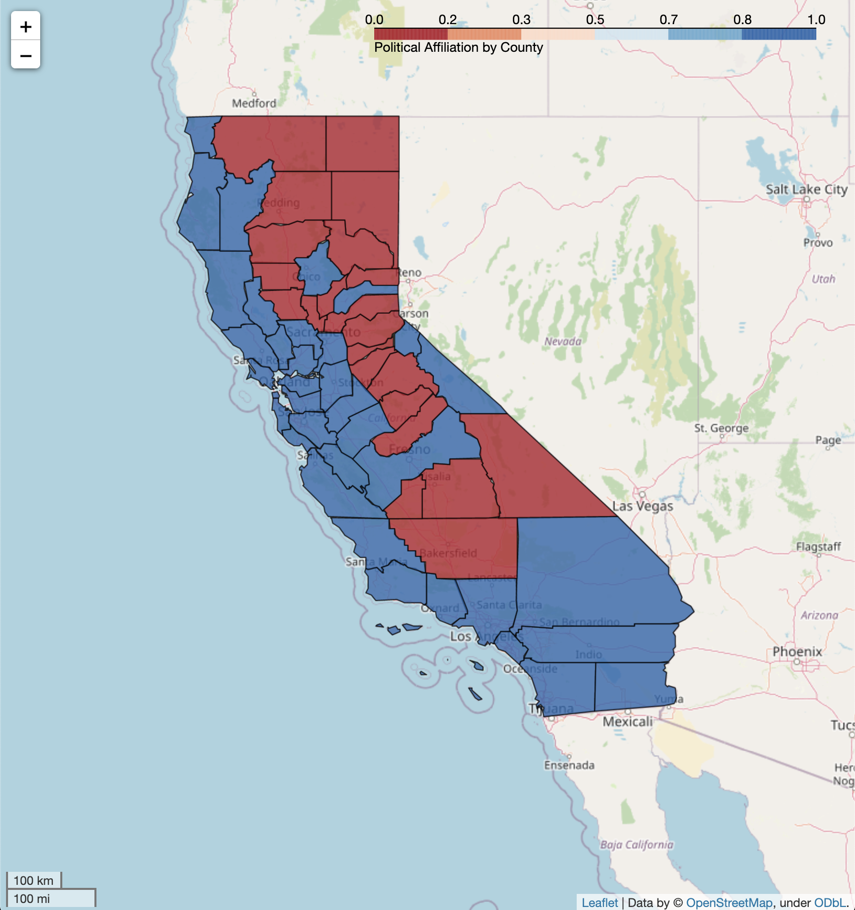
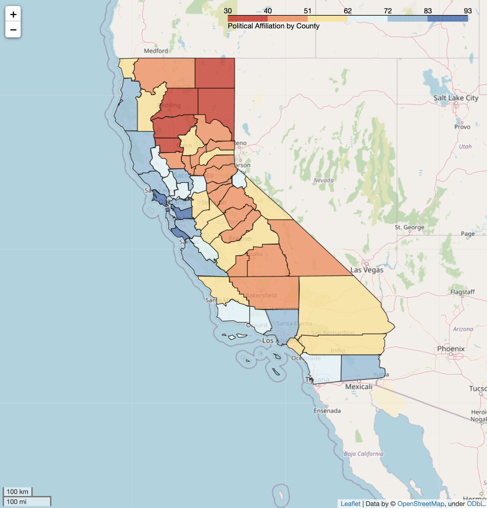
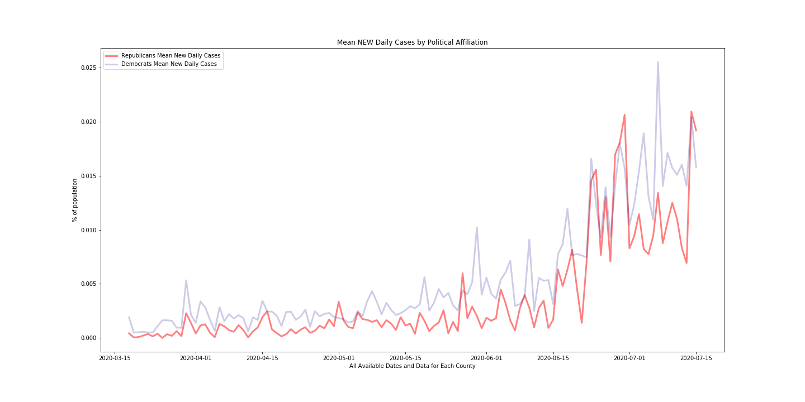
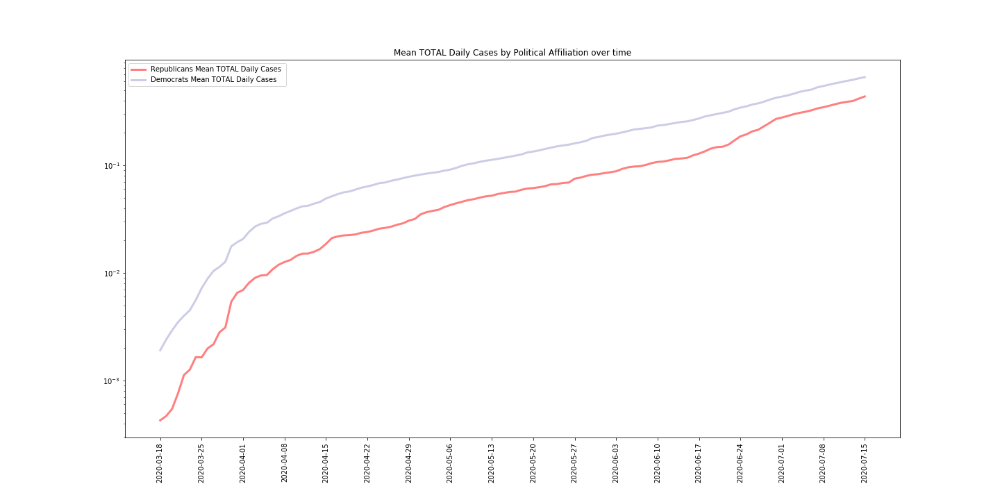

# Capstone 1: COVID-19 v. Political Affiliation in California by County

## **A. An Overview** 
With the presidential election heating up there is significant debate on social media around whether the Corona virus pandemic is being overblown by the media. It is suggested that Americans who believe that COVID-19 is a hoax and over blown in the media are less likely to take safty precautions to reduce the spread of the virus (ie. PPE like masks, social distancing, etc).  Many other Americans believe that we are truly in a global pandemic and are likely to follow the state mandates more consistently. While there are many debateable reasons for why this is the case, the 2 lines of thought can generally be bucketed into the 2 major political parties: Republican or Democrat.

MVP: The question I would like to answer is if there is a correlation between COVID infection rates and political affiliation for various counties in the state of California. MVP+ would be to see if there is any difference since the state started to reopen arounf May 18, 2020.  

## **B. The Raw Data** 

1. Voting Data for political affiliation was obtained from the State od California's official website: https://www.sos.ca.gov/elections/prior-elections/statewide-election-results/presidential-primary-election-june-7-2016/statement-vote/

    Format: 82KB .xls file

    *Original data (on left) needed some reformatting to be usable. Removed NaN and other extraneous rows during import (on right).*

           
 

2. COVID-19 Data by county for California was obtained from California Dept of Public Health: https://data.chhs.ca.gov/dataset/california-covid-19-hospital-data-and-case-statistics

    Format: 254 KB .csv file
    
    *This data was already pretty clean at download with very few to none formatiing issues or NaN values.* 

           
 

*Supplemental Data:*

3. Population by County: https://www.california-demographics.com/counties_by_population

    Format: .csv file

    

4. GeoJson Date(for maps): https://github.com/codeforamerica/click_that_hood/blob/master/public/data/california-counties.geojson 

    Format: 258KB .geojson file

    

5. Coordinates for each county(for maps): http://www.ala.org/rt/magirt/publicationsab/ca

## **C. Data Visualization**
### 1. California Political Affiliation by County:
  

**First Political Image - Democrat v. Republican Map:**
Democratic counties tend to be along the coast and have cities with higher population densities, Republican Counties are further inland and more rural populations

**Second Political Image - % Political Affiliation Map:**
This map goes beyond Democrat/Republican to show % of the counties political affiliation. You may notice that there are very few counties that are 'mostly' Democrat or Republican.

### 2. California COVID Rates by County

 

**First COVID Image - TOTAL COVID cases as a % of population as of July 15, 2020:**
This shows total (cumulative) cases in each county and is normalized by population. 

**Second COVID Image - NEW COVID cases as a % of population as of July 15,2020:**
This is a snapshot of only new cases as of the last day data was pulled for this project. Notice the overlap from the counties in the previous map. 

### 3. Political and COVID 
*....Now that we have explored each data set individually we can set out to better understand if political affiliation is correlated to COVID cases. Its not easy to tell if they are correlated just using the above maps.  (joined data sets for the following visualizations)* 

 

**Mean New Daily Cases for Republican vs. Democratic Counties (above):**
While not identical, it does appear that new daily cases seem to loosely mimic trends for both political affiliations.

    

**Mean TOTAL Daily Cases for Republican vs. Democratic Counties (First image above) and LOG version (Second image above):** These graphs seem to underscore that while Democratic counties have a higher % of covid cases per population, both types of counties have generally the same trajectory. Three is an interesting narrowing of the lines around late June, early July where it appears Republican counties are increasing faster than Democratic counties. 

 

 **Mean TOTAL cases (all counties and all days) vs. % Republican <==> % Democrat (sliding scale):** While an interesting excersize this graph doesnt tell us much other than making it obvious that there are more Democrat Counties (36 Counties) than Republican (22 Counties)

## **D. Hypothesis Testing**
In the state of California, is political affiliation and COVID cases correlated?

**H null: there is no difference between COVID rates from Republican and Democratic Counties**

**H alt: there is a significant difference between COVID rates in Republican and Democratic Counties**

Sample 1: Democratic Counties: mean county total cases by % of population   
Sample 2: Republican Counties: mean county total cases by % of population

alpha = .05
